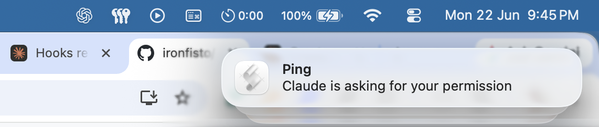

# ping

Plays a sound notification whenever Claude asks for your permission to run a tool.

Never miss a permission prompt again — step away from your keyboard and you'll still hear the ping.



## Install

**Step 1** — Add the marketplace:

```shell
/plugin marketplace add ironfisto/ping
```

**Step 2** — Install the plugin:

```shell
/plugin install ping@ping-plugins
```

**Step 3** — Try it out:

Run any command that requires permission and you'll hear the ping.

## How it works

Hooks into the `PermissionRequest` event. Every time Claude needs your approval to execute a command, edit a file, or use any tool, it fires a macOS notification with the "Blow" sound.

## Requirements

- macOS (uses `osascript`)
- Claude Code CLI
